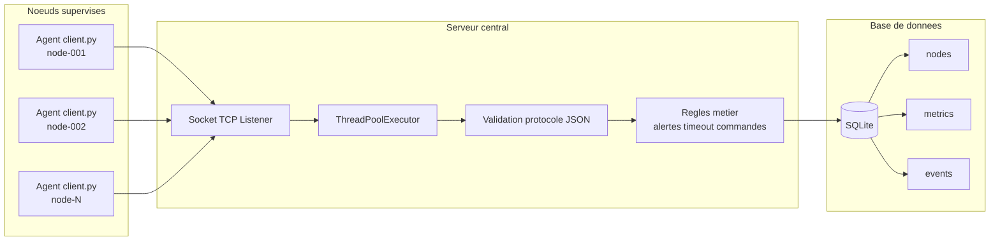
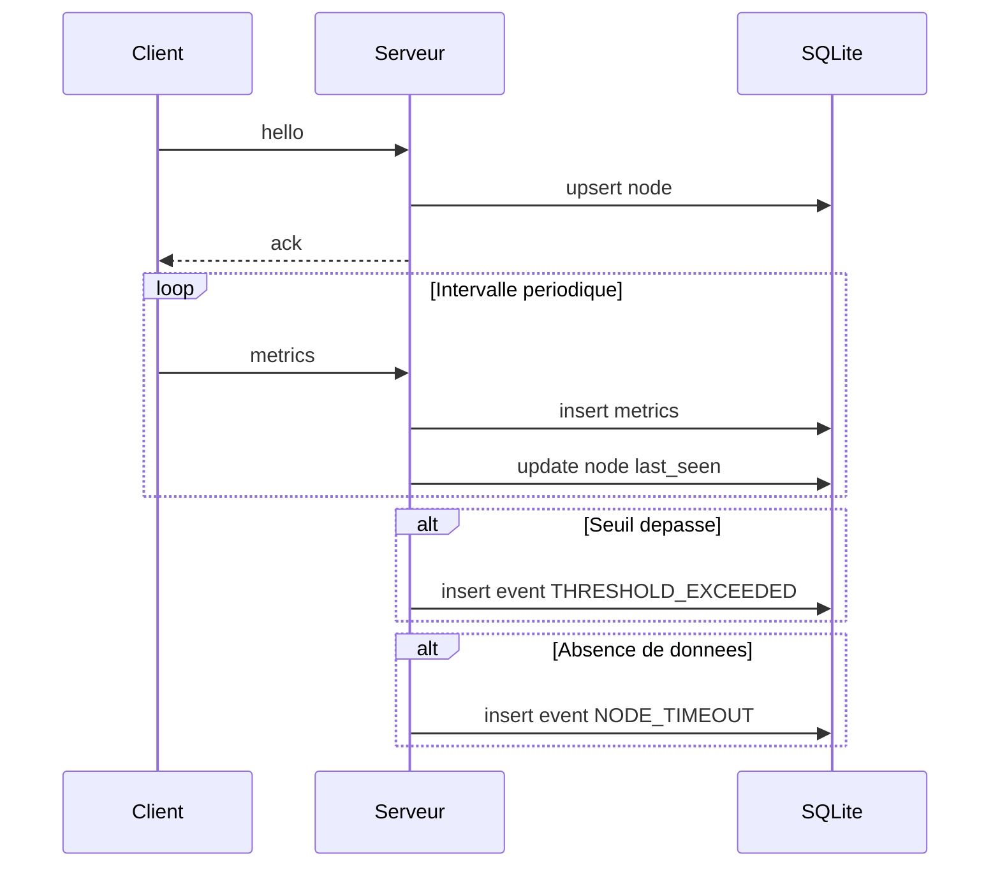

# Universite Numerique Cheikh Hamidou Kane

## UFR Sciences et Technologies

### Master 1 SRIV

# RAPPORT DE PROJET

## Systeme distribue de supervision reseau

**Equipe projet:** SRIV Master 1

**Membres de l equipe projet:**

| Nom | Email |
|---|---|
| Sidy DIAGNE | sidy.diagne@unchk.edu.sn |
| Dome FAYE | dome.faye@unchk.edu.sn |
| Ibrahima Khalil SECK | ibrahimakhalil.seck@unchk.edu.sn |

**Encadrant:** [Nom de l encadrant]

**Annee universitaire:** 2025-2026

**Session:** Fevrier 2026

---

## Remerciements

Nous adressons nos remerciements a notre encadrant pour son accompagnement pedagogique, ses orientations techniques et la disponibilite accordee tout au long du projet.

Nous remercions egalement le corps enseignant du Master 1 SRIV ainsi que l Universite Numerique Cheikh Hamidou Kane pour le cadre de travail mis a disposition.

## Engagement de non-plagiat

Nous soussignes, membres de l equipe projet SRIV Master 1, declarons que ce rapport est le resultat de notre travail personnel dans le cadre du projet de systemes repartis.

Nous attestons avoir cite les sources utilisees et nous engageons a respecter les regles d integrite academique en vigueur.

---

## Resume

Ce projet presente la conception et la realisation d un systeme distribue de supervision reseau base sur une architecture client-serveur. Des agents de supervision deployes sur plusieurs noeuds collectent periodiquement des metriques systeme et les transmettent a un serveur central via un protocole JSON sur TCP. Le serveur traite les donnees de facon concurrente, les persiste dans SQLite, detecte les anomalies et expose des fonctions d administration. Les experimentations montrent un fonctionnement stable sur plusieurs dizaines de clients simultanes.

## Abstract

This project presents the design and implementation of a distributed network monitoring system based on a client-server architecture. Monitoring agents deployed on multiple nodes periodically collect system metrics and send them to a central server through a JSON-over-TCP protocol. The server processes data concurrently, stores it in SQLite, detects anomalies, and provides administration features. Experimental results show stable behavior with dozens of simultaneous clients.

## Mots-cles

Systeme distribue, supervision reseau, client-serveur, JSON, TCP, concurrence, SQLite, monitoring.

---

## Sommaire

1. Introduction
2. Contexte et problematique
3. Objectifs du projet
4. Etude et conception
5. Architecture du systeme
6. Realisation technique
7. Protocole de communication
8. Gestion de la persistance
9. Strategie de tests et resultats
10. Limites et perspectives
11. Conclusion
12. References et webographie
13. Annexes

---

## 1. Introduction

La supervision est un besoin critique dans les systemes distribues modernes. Sans mecanisme centralise de collecte et d analyse, il est difficile d anticiper les pannes ou de diagnostiquer rapidement des degradations. Ce travail propose une solution pedagogique complete qui couvre la collecte, la transmission, le traitement et la persistance de metriques systeme.

## 2. Contexte et problematique

Le projet s inscrit dans le cadre des systemes repartis ou plusieurs machines distantes doivent etre observees en continu. Le probleme principal est de concevoir un systeme simple, robuste et evolutif, capable de:

- gerer plusieurs clients simultanement
- transporter les informations de supervision de maniere fiable
- stocker les donnees pour consultation et analyse
- detecter automatiquement les situations anormales

## 3. Objectifs du projet

Les objectifs fixes sont:

- developper un agent client de collecte des metriques
- developper un serveur central multi-clients
- definir un protocole applicatif JSON sur TCP
- implementer une base SQLite avec pool de connexions
- tracer les alertes et evenements de supervision
- fournir des commandes d administration cote serveur
- evaluer le systeme par des tests de charge

## 4. Etude et conception

### 4.1 Choix de l architecture

L architecture retenue est client-serveur. Ce modele permet de centraliser l intelligence metier au niveau du serveur, tout en gardant des agents clients legers sur les noeuds supervises.

### 4.2 Modelisation fonctionnelle

Le systeme comporte trois fonctions principales:

- acquisition: collecte locale des metriques
- transport: envoi periodique des messages au serveur
- exploitation: stockage, alertes, consultation et commandes

## 5. Architecture du systeme

### 5.1 Vue d ensemble

### 5.2 Composants logiciels

- client.py: collecte, envoi periodique, reception de commandes
- server.py: ecoute TCP, traitement concurrent, administration
- protocol.py: encodage/decodage et validation des messages
- database.py: acces SQLite et pool de connexions
- schema.sql: schema relationnel
- load_test.py: generation de charge multi-agents

## 6. Realisation technique

### 6.1 Agent client

L agent collecte:

- cpu_percent
- memory_percent
- disk_percent
- uptime_seconds
- etat logique de services
- etat de ports predefinis

Le client implemente une reconnexion automatique en cas d indisponibilite du serveur.

### 6.2 Serveur central

Le serveur:

- accepte les connexions TCP
- traite les messages avec un pool de threads
- persiste les metriques
- detecte les seuils de surcharge
- detecte les noeuds silencieux
- propose des commandes d administration

## 7. Protocole de communication

Le protocole est base sur JSON, un message par ligne.

Types de messages:

- hello
- metrics
- command
- command_result
- ack

### 7.1 Sequence d echange

## 8. Gestion de la persistance

Le schema contient:

- nodes: etat courant des noeuds
- metrics: historique detaille des metriques
- events: journal d evenements et alertes

SQLite est utilise pour sa simplicite de deploiement dans un contexte pedagogique. Le mode WAL et un pool de connexions sont utilises pour ameliorer la gestion des acces concurrents.

## 9. Strategie de tests et resultats

### 9.1 Validation syntaxique

Compilation Python validee sur les modules principaux.

### 9.2 Validation fonctionnelle

Echanges client-serveur verifies:

- hello et ack
- envoi et persistence des metrics
- generation des events

### 9.3 Validation de charge

Run A - Tentative initiale:

- 150 clients
- 145 secondes
- intervalle 15 secondes
- resultat: echec de connexion (Connection refused)
- analyse: serveur absent sur le port cible

Run B - Validation corrigee:

- 30 clients
- 35 secondes
- intervalle 5 secondes
- serveur actif sur 127.0.0.1:5000

Resultats observes:

- 30 noeuds enregistres
- 615 metriques persistees
- 100 evenements traces
- etat final des noeuds: disconnected apres l arret du test

Tableau de synthese:

| Run | Parametres | Serveur actif | Resultat |
|---|---|---|---|
| A | 150 clients, 145 s, intervalle 15 s | Non | Echec de connexion (Connection refused) |
| B | 30 clients, 35 s, intervalle 5 s | Oui | 30 noeuds, 615 metriques, 100 evenements |

Interpretation: la solution est fonctionnelle en charge moderee et convient pour un prototype de supervision distribuee.

## 10. Limites et perspectives

### 10.1 Limites

- absence de TLS
- absence d authentification forte des agents
- interface admin en console
- SQLite limitee pour forte volumetrie

### 10.2 Perspectives

- migration PostgreSQL
- ajout TLS et authentification
- tableau de bord web temps reel
- export vers ecosysteme de monitoring externe

## 11. Conclusion

Le projet atteint les objectifs fixes: architecture distribuee operationnelle, collecte multi-noeuds, communication fiable, traitement concurrent et persistance exploitable. Les tests montrent un comportement coherent et reproductible. Le systeme constitue une base solide pour des evolutions vers un niveau industriel.

## 12. References et webographie

- Documentation Python 3
- Documentation psutil
- Documentation SQLite
- Cours et TP de Systemes Repartis (UNCHK)

### 12.1 Webographie

- Python Software Foundation, Python 3 documentation: https://docs.python.org/3/
- Python Software Foundation, Socket programming: https://docs.python.org/3/library/socket.html
- Python Software Foundation, concurrent.futures: https://docs.python.org/3/library/concurrent.futures.html
- psutil documentation: https://psutil.readthedocs.io/
- SQLite documentation: https://www.sqlite.org/docs.html
- Mermaid documentation: https://mermaid.js.org/
- Zabbix: https://www.zabbix.com/
- Nagios XI (Nagios): https://www.nagios.com/products/nagios-xi/
- Nagios, How to reduce downtime with maintenance planning: https://www.nagios.com/article/how-to-reduce-downtime-with-maintenance-planning/
- ManageEngine OpManager: https://www.manageengine.com/network-monitoring/
- Pandora FMS: https://pandorafms.com/

## 13. Annexes

### Annexe A - Commandes utiles

Lancer le serveur:

python3 server.py --host 127.0.0.1 --port 5000 --db supervision.db --no-console

Lancer un test de charge:

python3 load_test.py --host 127.0.0.1 --port 5000 --count 30 --duration 35 --interval 5

### Annexe B - Structure du projet

- client.py
- server.py
- protocol.py
- database.py
- schema.sql
- load_test.py
- docs/
