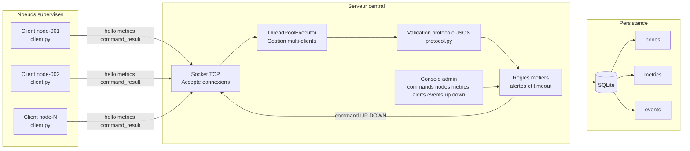

# Rapport Complet - Systeme distribue de supervision reseau

## 1. Contexte et problematique

Dans un environnement distribue, plusieurs machines doivent etre supervisees de maniere centralisee pour detecter rapidement les anomalies, pannes ou degradations de performance.

Le besoin principal est de collecter periodiquement des metriques systeme depuis plusieurs noeuds, puis de les traiter et stocker sur un serveur central.

## 2. Objectifs du projet

Le projet vise a mettre en place une solution complete de supervision distribuee avec les objectifs suivants:

- collecter les metriques CPU, memoire, disque, uptime
- verifier l etat logique de services et de ports
- transporter les donnees via un protocole applicatif JSON sur TCP
- gerer plusieurs clients simultanement
- persister les donnees de supervision dans une base SQLite
- generer des evenements d alerte et de timeout
- offrir une interface d administration simple cote serveur

## 3. Architecture globale

Le systeme suit une architecture client-serveur:

- Agents clients: collectent localement les metriques et envoient periodiquement des messages JSON
- Serveur central: recoit, valide, traite, persiste et supervise l activite des noeuds
- Base SQLite: conserve noeuds, metriques et evenements

### Schema d architecture (Mermaid)

## 4. Composants implementes

### 4.1 Client de supervision

Fichier principal: client.py

Fonctions principales:

- collecte metriques systeme via psutil
- detection ports et processus
- envoi periodique sur socket TCP
- gestion des commandes serveur UP et DOWN
- reconnexion automatique en cas de coupure

Messages emis:

- hello
- metrics
- command_result

### 4.2 Serveur central

Fichier principal: server.py

Fonctions principales:

- ecoute TCP sur host et port
- traitement concurrent avec ThreadPoolExecutor
- validation stricte des messages
- enregistrement des sessions noeuds
- detection de noeud inactif via timeout
- journalisation d evenements
- commandes d administration

Option pratique:

- no-console pour execution en arriere-plan

### 4.3 Protocole applicatif

Fichier principal: protocol.py

Caracteristiques:

- format JSON, un message par ligne
- controle de structure et champ type
- erreur protocolaire explicite en cas de message invalide

### 4.4 Couche base de donnees

Fichier principal: database.py

Choix techniques:

- SQLite pour simplicite de deploiement
- pool de connexions SQLite
- mode WAL pour meilleures ecritures concurrentes

Schema logique:

- nodes: etat courant de chaque noeud
- metrics: historique des mesures
- events: historique des alertes et evenements metier

## 5. Flux fonctionnel

1. Le client se connecte et envoie hello.
2. Le serveur enregistre le noeud et repond ack.
3. Le client envoie regulierement metrics.
4. Le serveur stocke metrics et met a jour nodes.
5. Si un seuil est depasse, un event THRESHOLD_EXCEEDED est ajoute.
6. Si un noeud ne remonte plus de donnees, un event NODE_TIMEOUT est genere.
7. L administrateur consulte nodes metrics alerts events.

## 6. Strategie de test et resultats

## 6.1 Test unitaire syntaxique

Compilation Python validee via compileall sur:

- client.py
- server.py
- database.py
- protocol.py
- load_test.py

## 6.2 Test fonctionnel client serveur

Resultat:

- connexion client reussie
- ack recu
- metriques stockees en base

## 6.3 Test de charge avec load_test.py

### Run A - Tentative initiale

Commande executee avec 150 clients sur 145 secondes.

Constat:

- erreurs Connection refused
- cause: serveur absent sur le port cible pendant ce run

### Run B - Validation corrigee

Parametres:

- 30 clients
- 35 secondes
- intervalle 5 secondes
- serveur actif sur 127.0.0.1:5000

Resultats observes:

- nodes: 30
- metrics: 615
- distinct_metric_nodes: 30
- events: 100
- etat final des noeuds: disconnected apres arret des clients (comportement attendu)

### Tableau de synthese des tests de charge

| Run | Parametres | Serveur actif | Resultat |
|---|---|---|---|
| A | 150 clients, 145 s, intervalle 15 s | Non | Echec de connexion (Connection refused) |
| B | 30 clients, 35 s, intervalle 5 s | Oui | 30 noeuds, 615 metriques, 100 evenements |

Interpretation:

- la chaine complete collecte, transport, traitement, persistance fonctionne
- les noeuds passent en disconnected a l arret du test, comportement attendu

## 7. Justification des choix

- TCP + JSON: simple, lisible, debuggable
- ThreadPoolExecutor: gestion simultanee de plusieurs clients
- SQLite: approprie pour prototype et demonstration
- pool de connexions: reduction du cout d ouverture fermeture et meilleure discipline d acces
- separation client serveur protocole base: meilleure maintenabilite

## 8. Limites actuelles

- pas d authentification forte des agents
- pas de chiffrement TLS sur la liaison client serveur
- interface admin en console uniquement
- actions UP DOWN appliquees a un etat logique et non a systemd
- SQLite non ideal pour tres grande charge

## 9. Pistes d amelioration

- migration vers PostgreSQL pour montee en charge
- ajout TLS et authentification des noeuds
- dashboard web temps reel
- export de metriques pour outils type Prometheus Grafana
- mise en file asynchrone pour lisser les pics de charge

## 10. Conclusion

Le projet realise une supervision distribuee complete, coherente avec les objectifs pedagogiques:

- acquisition de metriques multi-noeuds
- communication reseau client-serveur
- concurrence cote serveur
- persistance et exploitation des donnees
- demonstration de charge reproductible

La solution constitue une base solide pour une evolution vers un systeme de supervision de niveau production.

## 11. References et webographie

- Documentation Python 3: https://docs.python.org/3/
- Socket programming Python: https://docs.python.org/3/library/socket.html
- concurrent.futures Python: https://docs.python.org/3/library/concurrent.futures.html
- Documentation psutil: https://psutil.readthedocs.io/
- Documentation SQLite: https://www.sqlite.org/docs.html
- Documentation Mermaid: https://mermaid.js.org/