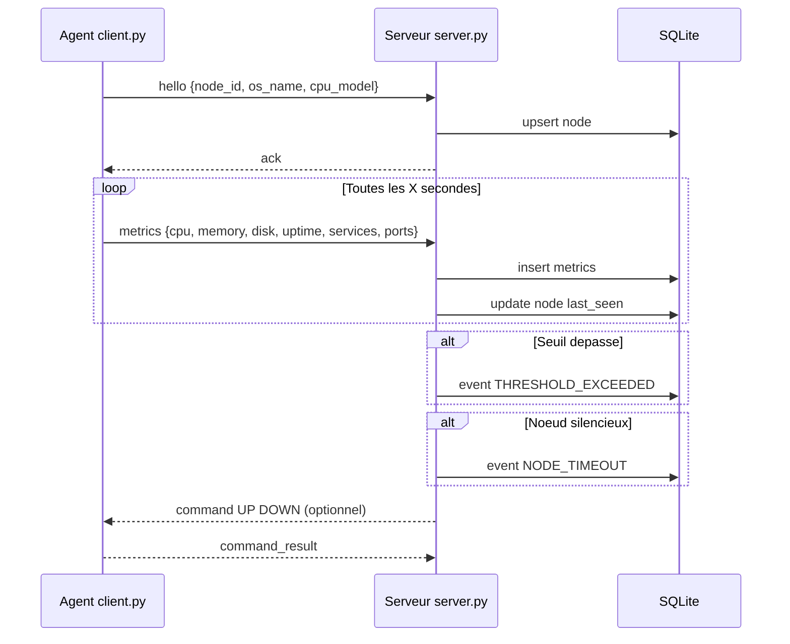

# Script de soutenance (5 a 7 minutes)

## 0. Objectif de la presentation

Durant cette soutenance, je vais presenter:

- le besoin et l architecture
- le fonctionnement technique
- une demonstration de charge
- les resultats obtenus et les limites

Temps cible: entre 5 et 7 minutes.

## 1. Introduction (0:00 - 0:45)

Bonjour.

Notre projet porte sur la supervision distribuee de machines.
L idee est de deployer un agent sur chaque noeud pour remonter des metriques vers un serveur central.
Le serveur stocke ces informations, detecte des alertes, et offre des commandes d administration.

## 2. Architecture (0:45 - 1:45)

Nous avons trois briques principales:

- client.py sur chaque noeud
- server.py sur le serveur central
- SQLite pour la persistance

Le protocole applicatif repose sur JSON sur TCP.
Le serveur est multi-clients avec un pool de threads.

### Schema a montrer (Mermaid)

## 3. Choix techniques (1:45 - 2:45)

Nos choix sont les suivants:

- JSON pour la simplicite de debug
- TCP pour une communication fiable
- ThreadPoolExecutor pour servir plusieurs agents en parallele
- SQLite avec pool de connexions pour un prototype simple et fonctionnel

Cela permet une base claire, testable et evolutive.

## 4. Demonstration en direct (2:45 - 5:15)

Ordre de demonstration recommande:

1. Lancer le serveur
2. Lancer un test de charge court
3. Verifier les donnees en base
4. Montrer les evenements

### Commandes de demonstration

Etape 1:

python3 server.py --host 127.0.0.1 --port 5000 --db /tmp/soutenance.db --no-console --log-level INFO

Etape 2:

python3 load_test.py --host 127.0.0.1 --port 5000 --count 30 --duration 35 --interval 5

Etape 3:

python3 - <<'PY'
import sqlite3
conn = sqlite3.connect('/tmp/soutenance.db')
print('nodes=', conn.execute('select count(*) from nodes').fetchone()[0])
print('metrics=', conn.execute('select count(*) from metrics').fetchone()[0])
print('events=', conn.execute('select count(*) from events').fetchone()[0])
conn.close()
PY

Etape 4:

python3 - <<'PY'
import sqlite3
conn = sqlite3.connect('/tmp/soutenance.db')
for row in conn.execute("select level, event_type, node_id, message from events order by created_at desc limit 10"):
    print(row)
conn.close()
PY

## 5. Resultats a annoncer (5:15 - 6:15)

Sur un run valide avec serveur actif:

- 30 noeuds enregistres
- 615 metriques stockees
- 100 evenements traces
- noeuds en disconnected a l arret, comportement attendu

Le run precedent a 150 clients avec Connection refused montre aussi un point important:

- la procedure de test doit verifier que le serveur ecoute avant de lancer la charge

Formulation courte conseillee a l oral:

- Run A (150 clients): echec de connexion car serveur non actif.
- Run B (30 clients): validation complete du pipeline de supervision.

## 6. Limites et perspectives (6:15 - 6:50)

Limites actuelles:

- pas de TLS
- pas d authentification des agents
- interface admin console
- SQLite limitee pour tres forte charge

Perspectives:

- PostgreSQL
- authentification et chiffrement
- dashboard web

## 7. Conclusion (6:50 - 7:00)

Le projet atteint ses objectifs: supervision multi-clients, persistance, alertes et test de charge reproductible.
La base technique est solide pour evoluer vers une solution plus industrielle.